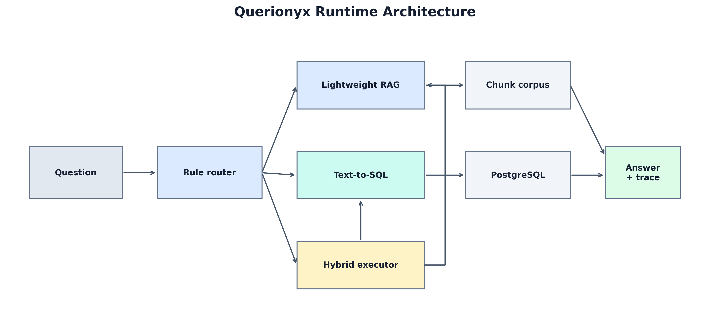

# Querionyx: Observable Hybrid RAG and Text-to-SQL for Enterprise Question Answering

[]()
[]()
[]()
[]()
[]()

- **Author:** Huynh Nhat Gia Lac - 31231026619, SE0001 K49
- **Supervisor:** Dr. Nguyen Quoc Hung
- **Institution:** University of Economics Ho Chi Minh City (UEH)
- **Repository:** https://github.com/PeanLutHuynh/querionyx
- **Live Demo:** https://querionyx.vercel.app/
- **API Docs:** https://querionyx.onrender.com/docs
- **Backend Health:** https://querionyx.onrender.com/health

Querionyx is a graduation-project framework for bilingual enterprise question answering over structured and unstructured evidence. It routes each question to document retrieval (RAG), PostgreSQL querying (Text-to-SQL), or parallel HYBRID execution and returns the answer together with citations, SQL rows, confidence, latency, fallback state, and a query-level trace.

The public profile is designed to run without Ollama. It combines a deterministic bilingual router, read-only Northwind SQL fast paths, and lightweight extractive retrieval over 9,670 annual-report chunks. Dense retrieval, BM25 fusion, and local Qwen generation remain available as optional research components.

> The Render backend may sleep after inactivity. The first live request can take up to approximately two minutes while the service starts; later requests are normally faster.

---

## Table of Contents

1. [Project Overview](#1-project-overview)
2. [Key Features](#2-key-features)
3. [Final Evaluation Results](#3-final-evaluation-results)
4. [System Architecture](#4-system-architecture)
5. [System Requirements](#5-system-requirements)
6. [Installation](#6-installation)
7. [Data and Database Setup](#7-data-and-database-setup)
8. [Running the System](#8-running-the-system)
9. [Usage Guide](#9-usage-guide)
10. [API Documentation](#10-api-documentation)
11. [Evaluation and Reproducibility](#11-evaluation-and-reproducibility)
12. [Project Structure](#12-project-structure)
13. [Deployment](#13-deployment)
14. [Troubleshooting](#14-troubleshooting)
15. [Dependencies](#15-dependencies)
16. [Research Scope](#16-research-scope)

---

## 1. Project Overview

Querionyx coordinates two enterprise evidence sources:

- **Structured data:** a PostgreSQL Northwind database for counts, rankings, aggregations, filters, and joins.
- **Unstructured data:** FPT, Masan, and Vinamilk annual reports from 2023-2025 for cited qualitative evidence.

The framework supports three execution intents:

| Intent | Evidence path | Typical question |
| --- | --- | --- |
| `RAG` | Annual-report retrieval with page citations | `Chiến lược tăng trưởng của Vinamilk là gì?` |
| `SQL` | Validated read-only PostgreSQL query | `Which product sold the most?` |
| `HYBRID` | RAG and SQL in parallel, followed by merge or explicit fallback | `Masan supply chain and top 5 products by quantity sold` |

Questions outside the indexed reports and connected database return an explicit insufficient-evidence response. Querionyx is not intended to answer current news, live share prices, private information, or arbitrary open-domain questions.

### Execution Profiles

| Profile | Purpose | Ollama | Retrieval |
| --- | --- | ---: | --- |
| `demo_no_ollama` | Public Render/Vercel demonstration | No | Lightweight deterministic retrieval |
| `local_research` | Optional local dense retrieval and generation | Optional | ChromaDB + BM25 + RRF |
| `evaluation_real` | Frozen automatic experiments | Depends on experiment | Exact configuration recorded per run |

---

## 2. Key Features

- Vietnamese and English rule-based routing for RAG, SQL, and HYBRID questions.
- Deterministic Text-to-SQL fast paths for common Northwind business-query families.
- Read-only SQL validation: only accepted `SELECT` or `WITH` statements reach PostgreSQL.
- Lightweight no-Ollama retrieval over a safe, inspectable compressed corpus.
- Optional multilingual dense retrieval, BM25, Reciprocal Rank Fusion, and Qwen 2.5 3B generation.
- Concurrent HYBRID branch execution with deterministic merge and partial fallback.
- Page-level document citations and structured SQL result tables.
- FastAPI endpoints, server-sent event streaming, health checks, and runtime metrics.
- Next.js interface with debug traces, sources, latency, confidence, cache, and branch state.
- Frozen benchmark datasets, SQL references, configurations, manifests, and per-query traces.
- Fully automatic reference-backed scoring; no manually assigned answer-quality score or LLM judge.
- Fail-closed evaluation: unavailable services are recorded as failures rather than replaced with simulated results.

The static no-Ollama readiness audit covers all 150 curated prompts, including the 100 SQL and HYBRID prompts that require deterministic SQL planning. This is implementation coverage for the public profile, not a claim of unrestricted semantic understanding.

---

## 3. Final Evaluation Results

The following values come from the frozen final experiment package under `reports/experiment_runs/`. The principal end-to-end benchmark contains 90 questions: 30 RAG, 30 SQL, and 30 HYBRID.

| Evaluation | Measured result |
| --- | ---: |
| Automatic evidence-alignment score, 90 queries | **0.9193** |
| Automatic pass rate, threshold 0.70 | **94.44%** |
| Technical completion rate | **100%** |
| SQL normalized result F1 | **1.0000** |
| RAG evidence-alignment score | **0.8345** |
| HYBRID integration score | **0.9917** |
| Router accuracy, curated 150 | **100%** |
| Router accuracy, stress 100 | **89%** |
| Sequential / async P50, 10 paired HYBRID queries | **364.55 / 338.13 ms** |
| Sequential / async P95, 10 paired HYBRID queries | **993.45 / 415.00 ms** |
| Exact sequential-async canonical output matches | **100%** |

### Baseline Comparison

The frozen 20-query comparison uses the same automatic evidence rubric for all systems.

| System | Automatic evidence score |
| --- | ---: |
| Querionyx | **0.9446** |
| Plain RAG | **0.5187** |
| LLM-only Qwen 2.5 3B | **0.2336** |

These are bounded reference and evidence-alignment measurements for the named datasets. They are not unrestricted free-form correctness scores and should not be generalized to unrelated documents, schemas, or open-domain questions.

---

## 4. System Architecture



```text
Question
   |
   v
Deterministic bilingual router
   |--------------------|----------------------|
   v                    v                      v
  RAG                   SQL                  HYBRID
   |                    |               RAG + SQL concurrently
Report chunks      Schema linking              |
Retrieval          Fast-path planner            v
Page citations     Read-only validation    Merge / fallback
   |                    |                      |
   |                    v                      |
   |               PostgreSQL                 |
   |____________________|______________________|
                        v
          Answer + sources + metrics + trace
```

FastAPI is exposed through `backend/main.py`. Runtime orchestration, response caching, health checks, and metrics live in `services/query_service.py`. Routing, RAG, SQL, HYBRID execution, observability, and evaluation are implemented under `src/`.

---

## 5. System Requirements

### Lightweight Runtime

| Component | Requirement |
| --- | --- |
| Operating system | Windows 10/11, Linux, or macOS |
| Python | **3.12 recommended**; `run.ps1` targets Python 3.12 |
| Node.js | **22 recommended** for the Next.js frontend |
| Database | PostgreSQL-compatible database populated with Northwind |
| RAM | 4 GB minimum; 8 GB recommended |
| GPU | Not required |
| Ollama | Not required |

### Optional Research Profile

| Component | Recommendation |
| --- | --- |
| RAM | 8 GB minimum; 16 GB recommended for model and vector-index work |
| Disk | Additional space for sentence-transformer models, ChromaDB, and Ollama models |
| Ollama model | `qwen2.5:3b` for the frozen LLM-only baseline and optional generation |
| GPU | Optional; CPU execution is supported |

---

## 6. Installation

### Step 1 - Clone or Extract the Project

```powershell
# Clone from GitHub
git clone https://github.com/PeanLutHuynh/querionyx.git
cd querionyx

# For a supplied ZIP, extract it and open PowerShell in the project root.
```

### Step 2 - Create the Environment File

```powershell
Copy-Item .env.example .env
```

Edit `.env` and provide the PostgreSQL connection values. Do not commit or share the completed `.env` file.

### Step 3 - Install the Lightweight Backend

```powershell
.\run.ps1 setup
```

This command creates `.venv` when needed and installs `requirements.txt`.

### Step 4 - Install the Frontend

Frontend dependencies are installed automatically on the first frontend start. To install them separately:

```powershell
Set-Location frontend
npm ci
Set-Location ..
```

### Step 5 - Optional Research Dependencies

```powershell
.\run.ps1 research-setup
```

This tier installs ChromaDB, sentence transformers, BM25, Ollama integration, PDF tooling, and plotting dependencies. It is unnecessary for the public no-Ollama profile.

### Step 6 - Verify the Installation

```powershell
.\run.ps1 check
```

The clone-level check compiles the Python modules, runs focused tests, audits deterministic no-Ollama coverage, and validates the frozen evidence package. It does not require Ollama or downloaded embedding models.

---

## 7. Data and Database Setup

### 7.1 Annual-Report Corpus

The runtime-ready corpus is already included:

```text
data/processed/chunks_recursive.json.gz
```

It contains 9,670 validated chunks in gzip-compressed UTF-8 JSON. The original nine PDFs are not redistributed in Git. Their filenames, sizes, and SHA-256 checksums are recorded in [`data/source_manifest.json`](data/source_manifest.json).

Optional full-RAG experiments require rebuilding the ChromaDB index:

```powershell
.\run.ps1 research-setup
.\.venv\Scripts\python.exe -m src.data_prep.reindex_chromadb
```

### 7.2 Northwind PostgreSQL

Querionyx expects an existing PostgreSQL database containing the Northwind schema and data. A database dump is not bundled with the repository. Configure these values in `.env`:

```dotenv
PGHOST=localhost
PGPORT=5432
PGDATABASE=northwind
PGUSER=postgres
PGPASSWORD=change-me
PGSSLMODE=prefer
```

A compatible PostgreSQL source is [`pthom/northwind_psql`](https://github.com/pthom/northwind_psql), which provides an importable `northwind.sql` script. Before reproducing the frozen evaluation, verify the imported table names and row counts against [`docs/data_prep/northwind_schema.md`](docs/data_prep/northwind_schema.md).

For Supabase or another hosted PostgreSQL service, use its connection values and set `PGSSLMODE=require`. The database account should be read-only for evaluation.

Without a database connection, the API and RAG path still start. SQL and complete HYBRID requests return an explicit unavailable or insufficient-evidence result.

### 7.3 Cache Semantics

Runtime Text-to-SQL and response caches improve latency for repeated questions. They do not add knowledge, train the router, or count as evaluation references. Cache hits and match types are recorded separately in the response metrics.

---

## 8. Running the System

### Method 1 - Public Web Demo

Open https://querionyx.vercel.app/.

The frontend calls the Render API. After a period of inactivity, allow up to approximately two minutes for the first request while the backend wakes up.

### Method 2 - Local Backend and Frontend

Start the API:

```powershell
.\run.ps1 api
```

Open another terminal and start the frontend:

```powershell
.\run.ps1 frontend
```

Local URLs:

- Web interface: `http://localhost:3000`
- API documentation: `http://localhost:8000/docs`
- Health endpoint: `http://localhost:8000/health`
- Metrics endpoint: `http://localhost:8000/metrics`

### Method 3 - Backend Only

```powershell
.\.venv\Scripts\python.exe -m uvicorn backend.main:app --host 0.0.0.0 --port 8000 --reload
```

### Method 4 - Docker Compose

```powershell
Copy-Item .env.example .env
# Edit .env before continuing.
.\run.ps1 up
```

The Compose stack builds the backend and frontend. It expects an external populated PostgreSQL database and deliberately does not create an empty database container.

Useful Docker commands:

```powershell
.\run.ps1 ps
.\run.ps1 logs
.\run.ps1 down
```

---

## 9. Usage Guide

### 9.1 Web Interface

1. Enter a Vietnamese or English question.
2. Enable **Debug** when routing, timing, SQL, source, or fallback evidence is needed.
3. Submit the question.
4. Inspect the answer and the intent, confidence, latency, cache, branch, and source panels.

Expected behavior by path:

- **RAG:** prose evidence plus annual-report filename and page citations.
- **SQL:** a structured result table and no document citation.
- **HYBRID:** SQL rows and cited report evidence, or an explicit label for a missing branch.
- **Unsupported:** a clear insufficient-evidence response without an invented source.

### 9.2 Demonstration Prompts

| Path | Prompt | Expected output |
| --- | --- | --- |
| RAG | `Ban lãnh đạo FPT gồm những ai?` | FPT report evidence with page citations |
| RAG | `Chiến lược tăng trưởng của Vinamilk là gì?` | Vinamilk growth evidence with citations |
| RAG | `Masan đề cập cơ hội nào trong tài liệu?` | Masan opportunity evidence with citations |
| SQL | `Which product sold the most?` | Ranked Northwind product quantities |
| SQL | `Top 5 customers by number of orders.` | Five-row customer ranking |
| HYBRID | `Masan supply chain and top 5 products by quantity sold` | Masan citations plus SQL ranking |
| Unsupported | `What is FPT's stock price today?` | Explicit insufficient-evidence response |

Minor paraphrases are supported when they retain recognizable intent and operation signals. The public profile should not be treated as a general conversational assistant.

### 9.3 Debug Trace

Debug mode exposes:

- selected intent and router type;
- confidence, matched signals, and branch list;
- SQL, RAG, merge, and end-to-end timings;
- generated read-only SQL and returned rows;
- retrieved passages and page citations;
- cache hit state, fallback, timeout, and failure categories;
- stable trace identifier for log correlation.

---

## 10. API Documentation

### Endpoints

| Method | Endpoint | Purpose |
| --- | --- | --- |
| `POST` | `/query` | Execute one question and return a complete JSON response |
| `POST` | `/query/stream` | Stream metadata and final result as server-sent events |
| `GET` | `/health` | Inspect API, database, corpus, cache, and retrieval warm-up state |
| `GET` | `/metrics` | Inspect latency, cache, routing, and failure aggregates |

### POST /query

Request:

```json
{
  "question": "Which product sold the most?",
  "debug": true
}
```

PowerShell:

```powershell
$body = @{
    question = "Which product sold the most?"
    debug = $true
} | ConvertTo-Json

Invoke-RestMethod `
    -Method Post `
    -Uri http://localhost:8000/query `
    -ContentType application/json `
    -Body $body
```

curl:

```bash
curl -X POST http://localhost:8000/query \
  -H "Content-Type: application/json" \
  -d '{"question":"Which product sold the most?","debug":true}'
```

The response includes the answer, sources, intent, confidence, latency, router type, branch state, fallback and timeout flags, cache state, stage timings, trace ID, and optional raw debug payload.

### GET /health

A healthy public response reports:

```json
{
  "status": "ok",
  "pipeline_version": "querionyx-v3",
  "db_status": "ok",
  "rag_status": {
    "chunks_file": "ok",
    "chunk_count": 9670
  }
}
```

Interactive OpenAPI documentation is available at `http://localhost:8000/docs` or `https://querionyx.onrender.com/docs`.

---

## 11. Evaluation and Reproducibility

### 11.1 Frozen Evaluation Sets

| Dataset | Cases | Role |
| --- | ---: | --- |
| `eval_150_queries.json` | 150 | Curated bilingual router coverage and no-Ollama readiness |
| `eval_90_queries.json` | 90 | Principal RAG, SQL, and HYBRID answer-quality evaluation |
| `router_stress_100.json` | 100 | Adversarial and indirect routing robustness |
| Baseline selection | 20 | LLM-only, Plain RAG, and Querionyx comparison |
| Component selection | 30 | Five variants on all HYBRID cases |
| Async selection | 10 pairs | Sequential versus concurrent HYBRID execution |

The 90-query set is a balanced subset of the curated 150-query collection. It is the principal end-to-end benchmark for the supported domain, not an independent held-out router test. The separate 100-query stress set provides the stronger routing-generalization boundary.

### 11.2 Automatic Evidence Scoring

- **Routing:** exact predicted-versus-expected intent agreement.
- **SQL:** real execution plus normalized row-level F1 against independent read-only reference SQL.
- **RAG:** evidence presence, expected-company citation, expected-topic coverage, and extractive overlap.
- **HYBRID:** route, SQL, RAG, both-branch completion, and merge evidence.

The automatic pass threshold is `0.70`. Technical completion is reported separately. No LLM judge or manually assigned answer-quality score is used. See [`docs/evaluation/EVALUATION_POLICY.md`](docs/evaluation/EVALUATION_POLICY.md) for formulas and reporting boundaries.

### 11.3 Run Verification Checks

```powershell
.\run.ps1 check
```

Equivalent high-level checks include compilation, focused regression tests, deterministic planner coverage, corpus validation, and evidence-package integrity.

### 11.4 Reproduce All Experiments

Requirements:

- a populated matching Northwind database;
- `requirements-research.txt` installed;
- Ollama with `qwen2.5:3b` for the LLM-only baseline and full local components.

Run:

```powershell
.\run.ps1 research-setup
.\run.ps1 evaluate
```

Outputs are written under `reports/experiment_runs/`. Each final run records source, dataset, configuration, reference, and corpus hashes; runtime environment; selected query IDs; raw outputs; failures; and per-query traces.

### 11.5 Regenerate Thesis Assets

```powershell
.\run.ps1 assets
```

Generated report-ready tables and figures are stored in `docs/thesis_assets/`. The current reportable result artifacts share source snapshot:

```text
76ed4ff2c1f0ea25d0011b8f8006b6cd02b2fe680b29b2463f448d357bb2294e
```

Full artifact checksums are retained in machine-readable manifests rather than copied manually into the README or thesis prose.

---

## 12. Project Structure

```text
querionyx/
|-- backend/                       FastAPI application entry point
|-- frontend/                      Next.js web interface
|   |-- app/                       Page shell and global styles
|   `-- components/                Chat, metrics, source, SQL, and debug views
|-- services/                      Query orchestration, cache, health, and metrics
|-- src/
|   |-- router/                    Deterministic and optional Ollama routing
|   |-- rag/                       Optional dense + BM25 local RAG
|   |-- sql/                       Schema linking, planning, validation, execution
|   |-- hybrid/                    Concurrent branches, merge, and fallback
|   |-- runtime/                   Config, schemas, timeouts, logs, chunk store
|   |-- evaluation/                Reference-backed experiment tools
|   |-- data_prep/                 PDF inspection, chunking, dense reindexing
|   `-- uat/                       User-acceptance workflow support
|-- benchmarks/
|   |-- datasets/                  Frozen query collections
|   |-- references/                Independent SQL reference mapping
|   |-- configs/                   Principal and component configurations
|   `-- manifests/                 Frozen selections and checksums
|-- data/
|   |-- processed/                 Tracked compressed report corpus
|   |-- raw/                       Optional original annual reports, ignored by Git
|   |-- models/                    Optional downloaded models, ignored by Git
|   |-- chroma_db/                 Optional vector index, ignored by Git
|   `-- cache/                     Runtime cache, excluded from evidence
|-- reports/experiment_runs/       Final raw outputs, summaries, and traces
|-- scripts/                       Audits, integrity checks, cleanup, asset export
|-- tests/                         Focused unit and regression tests
|-- deployment/render/             Render Blueprint
|-- docs/                          Deployment, evaluation, and thesis materials
|-- compose.yaml                   Backend and frontend Docker stack
|-- requirements.txt               Lightweight runtime dependencies
|-- requirements-research.txt      Optional research dependencies
|-- run.ps1                        Windows command runner
`-- README.md
```

---

## 13. Deployment

### Public Services

| Component | Service | URL |
| --- | --- | --- |
| Frontend | Vercel | https://querionyx.vercel.app/ |
| Backend | Render | https://querionyx.onrender.com/ |
| Database | Supabase PostgreSQL | Configured through Render secrets |

The frontend and backend health endpoint returned HTTP 200 during verification on **18 July 2026**. The backend reported `db_status=ok`, 9,670 loaded chunks, and completed retrieval warm-up.

### Render

The Blueprint is stored at [`deployment/render/render.yaml`](deployment/render/render.yaml). It uses the lightweight no-Ollama profile. Configure `PGPASSWORD` only in the Render secret manager; do not place it in source control.

### Vercel

Set the Vercel project root to `frontend/` and configure:

```dotenv
NEXT_PUBLIC_API_BASE=https://querionyx.onrender.com
```

### Cold Start

Render may suspend the backend after inactivity. During a cold start:

1. The frontend can load before the API is ready.
2. The first query may wait up to approximately two minutes.
3. The backend then loads the compressed corpus and prewarms its token index.
4. Later requests normally avoid the startup delay.

Cold-start hosting delay is separate from the local latency results in the thesis.

---

## 14. Troubleshooting

### The live page loads but the first query is slow

The Render backend is probably waking from an idle state. Wait up to approximately two minutes and retry once. Check `https://querionyx.onrender.com/health` before diagnosing the frontend.

### `db_status` is unavailable

Check `PGHOST`, `PGPORT`, `PGDATABASE`, `PGUSER`, `PGPASSWORD`, and `PGSSLMODE`. Hosted Supabase connections normally require `PGSSLMODE=require`. Verify that the password has not been rotated and that the Northwind tables exist.

### RAG reports zero chunks

Confirm that this file exists and is readable:

```text
data/processed/chunks_recursive.json.gz
```

Then run:

```powershell
.\run.ps1 check
```

### Ollama connection refused

Ollama is optional for public-demo mode. Keep these settings for a no-Ollama run:

```dotenv
QUERIONYX_LIGHTWEIGHT_RAG=1
QUERIONYX_MERGE_LLM_ENABLED=0
QUERIONYX_USE_LLM_ROUTER=0
```

For local research, start Ollama and install the frozen baseline model:

```powershell
ollama pull qwen2.5:3b
ollama serve
```

### Python 3.12 is not found

Install Python 3.12 and confirm:

```powershell
py -3.12 --version
```

Then remove only the broken `.venv` manually if necessary and rerun `./run.ps1 setup`.

### Port 8000 or 3000 is already in use

Stop the existing development process or start the service directly on another port. When changing the API port, update `NEXT_PUBLIC_API_BASE` for the frontend.

### Frontend dependencies fail to install

```powershell
Set-Location frontend
npm cache verify
npm ci
Set-Location ..
```

### SQL returns an insufficient-evidence response

Enable debug mode and inspect `raw.sql.error`, generated SQL, relevant tables, timeout state, and database health. Cache does not repair an unavailable database.

### Full evaluation stops early

This is expected when a required service is unavailable. The evaluation is fail-closed. Verify PostgreSQL, install the research dependencies, start Ollama with `qwen2.5:3b`, and rerun the affected experiment or `./run.ps1 evaluate`.

---

## 15. Dependencies

### Lightweight Runtime (`requirements.txt`)

| Package | Version | Purpose |
| --- | ---: | --- |
| `fastapi` | 0.136.1 | REST API and OpenAPI |
| `pydantic` | 2.13.4 | Request and response validation |
| `uvicorn` | 0.46.0 | ASGI server |
| `psycopg2-binary` | 2.9.12 | PostgreSQL connectivity |
| `python-dotenv` | 1.2.2 | Local environment loading |
| `psutil` | 7.2.2 | Runtime resource metrics |

### Optional Research Tier (`requirements-research.txt`)

| Package | Version | Purpose |
| --- | ---: | --- |
| `chromadb` | 1.5.9 | Persistent dense-vector index |
| `sentence-transformers` | 5.4.1 | Multilingual embeddings |
| `rank-bm25` | 0.2.2 | Sparse BM25 retrieval |
| `langchain-ollama` | 1.1.0 | Local Ollama integration |
| `langchain-community` | 0.4.1 | Research pipeline integrations |
| `langchain-text-splitters` | 1.1.2 | Optional chunking experiments |
| `PyMuPDF` | 1.27.2.3 | PDF inspection and text extraction |
| `matplotlib` | 3.10.9 | Thesis figures |

### Frontend (`frontend/package.json`)

| Package | Version | Purpose |
| --- | ---: | --- |
| `next` | 14.2.15 | Web application framework |
| `react` / `react-dom` | 18.3.1 | Interface rendering |
| `lucide-react` | ^0.468.0 | Interface icons |
| `typescript` | ^5.6.0 | Static typing |

---

## 16. Research Scope

Querionyx is a bounded research demonstrator, not a production-grade general assistant.

- It answers from the indexed FPT, Masan, and Vinamilk annual reports and the connected Northwind database.
- The principal 90-query evidence benchmark is a balanced subset of the curated 150-query collection, while the separate stress set measures harder routing behavior.
- SQL result F1 is strong evidence for the frozen Northwind state, not proof of cross-schema generalization.
- RAG scoring measures source and topic alignment, not unrestricted semantic completeness or human preference.
- No human assessor or LLM judge contributes to the reported automatic scores.
- Public deployment availability and cold-start latency are not part of the frozen local experiment results.

Research-governance and report assets:

- [Evaluation policy](docs/evaluation/EVALUATION_POLICY.md)
- [Project freeze](docs/PROJECT_FREEZE.md)
- [Claim-evidence matrix](docs/thesis_claim_evidence_matrix.md)
- [Benchmark specification](benchmarks/README.md)
- [Thesis asset catalog](docs/thesis_assets/README.md)
- [Deployment checklist](docs/deployment_demo_checklist.md)
- [Data layout and source verification](data/README.md)

---

## Quick Start Summary

```powershell
git clone https://github.com/PeanLutHuynh/querionyx.git
cd querionyx
Copy-Item .env.example .env
# Edit PostgreSQL values in .env.
.\run.ps1 setup
.\run.ps1 api
```

In a second terminal:

```powershell
.\run.ps1 frontend
```

Open `http://localhost:3000`, or use the public demonstration at https://querionyx.vercel.app/.

---

*Querionyx - University of Economics Ho Chi Minh City (UEH) | SE0001 K49 | 2025-2026*
