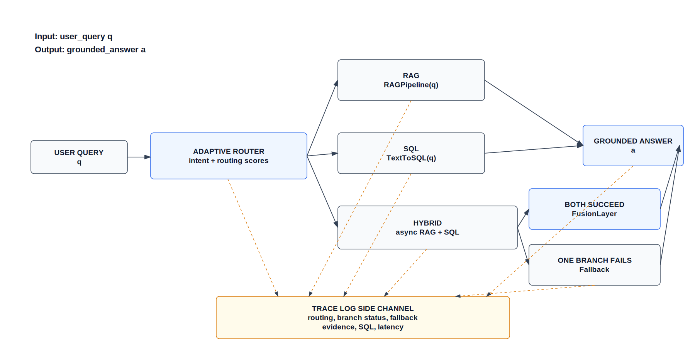
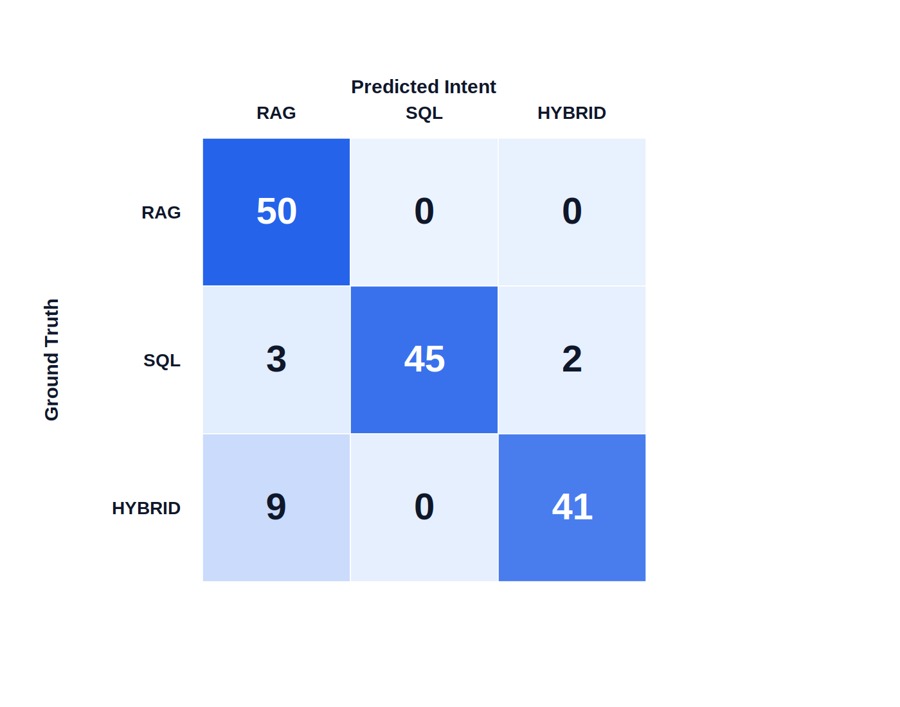
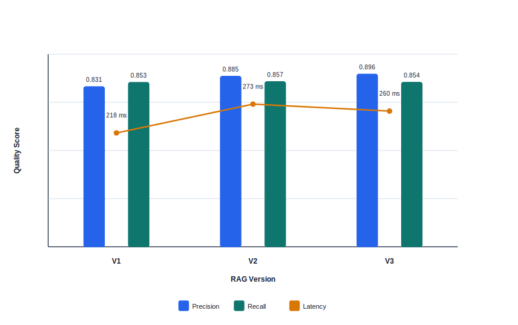
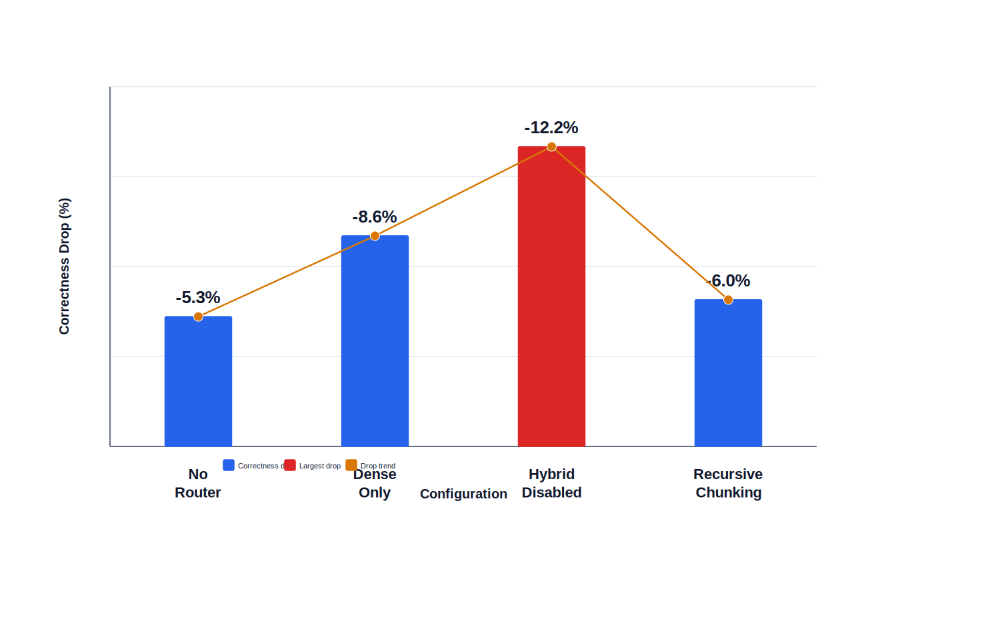

# TITLE

Building and Evaluating Querionyx: An Intelligent Enterprise Q&A System Combining Retrieval-Augmented Generation and Text-to-SQL with Adaptive Query Routing

# ABSTRACT

Enterprise information is commonly fragmented across heterogeneous sources, including unstructured documents, relational databases, and operational metadata. While retrieval-augmented generation (RAG) provides an effective mechanism for grounding language-model responses in document collections, it is insufficient for precise structured query processing. Conversely, Text-to-SQL systems can answer quantitative questions over databases but cannot directly interpret evidence contained in enterprise reports. This paper presents **Querionyx**, an intelligent question answering system that integrates retrieval-augmented generation, structured query processing, and adaptive query routing for enterprise data. Querionyx combines a document-oriented RAG pipeline for PDF annual reports, a Text-to-SQL pipeline for the Northwind relational database, and a hybrid query handler that executes document retrieval and SQL querying in parallel before merging evidence. The system is implemented as a full-stack application using FastAPI and Next.js, with ChromaDB, BM25, and PostgreSQL supporting retrieval and execution. We evaluate Querionyx using a three-layer framework covering query routing, answer quality, and system performance. The final benchmark contains 90 balanced queries across RAG, SQL, and HYBRID categories. Results show that deterministic adaptive routing achieves 84.44% routing accuracy with negligible latency, RAG V3 improves context precision to 0.8960, Text-to-SQL reaches 86.67% execution accuracy, and hybrid processing achieves 85.00% correctness. Ablation results demonstrate that disabling hybrid execution reduces correctness by 14.50%.  

**Keywords:** retrieval-augmented generation, Text-to-SQL, query routing, enterprise question answering, hybrid retrieval, structured query processing, system evaluation.

# 1. INTRODUCTION

Modern enterprises increasingly store knowledge across heterogeneous data sources. Strategic explanations, risk disclosures, and operational narratives are commonly found in annual reports, policy documents, and other unstructured files, whereas transactional information is stored in relational databases. In practice, users often formulate questions that cross these boundaries. For example, a business analyst may ask for a company's strategic direction and a related quantitative indicator in the same query. Such questions require both document-level semantic retrieval and structured query execution.

Retrieval-augmented generation (RAG) has become a dominant architecture for grounding language-model outputs in external documents [1], [3]. By retrieving relevant passages before generation, RAG reduces hallucination and allows information to be updated without retraining the language model. However, RAG is not designed to compute exact aggregations, rankings, or joins over relational data. It may retrieve text describing a metric but cannot reliably execute a database query such as counting orders, ranking customers, or computing revenue from order details.

Text-to-SQL addresses a complementary problem by translating natural language questions into executable SQL [2]. Such systems are well suited for structured databases but depend heavily on schema linking, column disambiguation, and query execution correctness. They are also limited when the user asks for qualitative explanations, policy descriptions, or document-based evidence that does not exist in relational tables.

This separation creates a gap for enterprise question answering. Existing systems often treat document QA and database QA as independent tasks. Yet real enterprise queries may require routing, decomposition, parallel execution, and answer fusion. Recent work on modular RAG suggests that complex systems should be constructed from reconfigurable components rather than a single monolithic retrieval-generation pipeline [4]. Querionyx follows this direction by treating routing, retrieval, SQL generation, and hybrid fusion as separate but coordinated modules.

This paper makes the following contributions:

- **A hybrid enterprise Q&A architecture.** Querionyx combines retrieval-augmented generation over PDF annual reports with Text-to-SQL over the Northwind relational database.
- **An adaptive query routing mechanism.** The system classifies questions into RAG, SQL, and HYBRID intents using a deterministic rule-based layer and an LLM-based router retained as a negative baseline.
- **A hybrid query handler.** For multi-source queries, Querionyx performs asynchronous RAG and SQL execution and merges evidence using deterministic templates or LLM-based fusion when appropriate.
- **A three-layer evaluation framework.** The evaluation separately measures routing quality, answer quality, and system performance, allowing errors and latency to be attributed to specific layers.
- **A reproducible paper-ready benchmark.** The final evaluation uses 90 balanced queries and exports tables, figures, and consolidated metrics for academic reporting.

The study is guided by the following research questions:

- **RQ1:** How accurately can adaptive query routing distinguish between unstructured, structured, and hybrid enterprise questions?
- **RQ2:** How effectively do the RAG, Text-to-SQL, and Hybrid modules answer questions over heterogeneous enterprise data?
- **RQ3:** What are the latency, throughput, and robustness trade-offs of a modular hybrid RAG-SQL architecture?

# 2. RELATED WORK

### 2.1 Retrieval-Augmented Generation

Retrieval-augmented generation was introduced to combine parametric memory in neural language models with non-parametric memory from external corpora [1]. Instead of requiring a model to memorize factual knowledge, RAG retrieves relevant passages and conditions generation on the retrieved context. This design improves factual grounding and enables knowledge updates through index refreshes. Later surveys identify a progression from naive RAG to advanced and modular RAG systems, emphasizing query rewriting, hybrid search, reranking, and context compression [3].

In enterprise environments, RAG is valuable because documents such as annual reports, policies, and compliance files contain semantically rich information. However, classical RAG pipelines are limited by chunking quality, retrieval drift, and difficulty answering questions that require exact computation. Querionyx addresses these limitations by comparing multiple RAG versions and combining document retrieval with structured query processing.

### 2.2 Text-to-SQL

Text-to-SQL systems translate natural language into executable SQL over relational schemas. The Spider benchmark highlighted the challenge of cross-domain semantic parsing, especially schema linking and complex SQL generation [2]. In enterprise systems, Text-to-SQL is useful for answering questions involving counts, sums, averages, rankings, and filters. However, it depends on accurate mapping between user language and database schema. Errors often arise from ambiguous table names, missing joins, or incorrect column references.

Querionyx implements a production-oriented Text-to-SQL pipeline with schema linking, prompt-based SQL generation, read-only SQL validation, execution, and retry. This module is evaluated separately from document retrieval to expose structured query processing errors rather than hiding them within an end-to-end score.

### 2.3 Hybrid Search

Hybrid search combines dense vector retrieval with sparse lexical retrieval. Dense retrieval captures semantic similarity, while sparse methods such as BM25 preserve exact lexical matches. In Querionyx, the RAG pipeline uses dense retrieval through ChromaDB and sparse retrieval through BM25, followed by reciprocal rank fusion. This design is motivated by the observation that enterprise queries may contain both semantic concepts and exact company or metric names.

RAG V3 further introduces semantic chunking and hybrid retrieval. The experimental results show that RAG V3 improves precision while recall remains stable. We interpret this as retrieval coverage saturation: the benchmark corpus already exposes most relevant evidence to earlier versions, so later improvements primarily reduce irrelevant context rather than significantly increasing coverage.

### 2.4 Query Routing in LLM Systems

Modular RAG systems require routing decisions before retrieval or generation [4]. A router may select a document index, a database, a tool, or a multi-step workflow. LLM-based routing is attractive because language models can interpret ambiguous instructions, but it introduces latency and may behave inconsistently under domain-specific constraints.

Querionyx evaluates three routing strategies: a rule-based router, an LLM-based router, and an adaptive router. The LLM router is retained as a negative baseline rather than optimized as a contribution. We include it to show that naive LLM routing can be inefficient in both accuracy and latency. The final runtime path therefore prioritizes deterministic routing for stability and reproducibility.

### 2.5 Evaluation Frameworks

RAG evaluation requires more than final answer accuracy. RAGAS introduced metrics for faithfulness, answer relevance, context precision, and context recall [5]. These metrics separate retrieval quality from generation quality and make it possible to diagnose failure modes in retrieval-augmented systems.

Querionyx extends this evaluation perspective to hybrid enterprise QA. The proposed framework evaluates three layers: router behavior, answer quality, and system performance. Router evaluation measures intent accuracy and confusion matrices. Answer quality evaluation measures RAG precision and recall, SQL execution accuracy, and hybrid correctness. System evaluation measures latency percentiles, throughput, and resource usage.

### 2.6 Research Gap

Prior work has advanced RAG, Text-to-SQL, and modular orchestration independently, but fewer systems evaluate how these components interact in a single enterprise Q&A workflow. In particular, there is a need for systems that: (i) route between unstructured and structured sources, (ii) execute hybrid queries over both documents and databases, (iii) report failure modes transparently, and (iv) evaluate both answer quality and system-level performance. Querionyx addresses this gap through an implemented full-stack system and a reproducible evaluation pipeline.

# 3. SYSTEM DESIGN AND IMPLEMENTATION

### 3.1 System Overview Architecture

Querionyx is designed as a modular enterprise Q&A system. A user query is first processed by the adaptive router, which classifies it as RAG, SQL, or HYBRID. RAG queries are sent to the document pipeline, SQL queries are sent to the structured query pipeline, and HYBRID queries are processed by the hybrid handler. The hybrid handler executes RAG and SQL branches asynchronously, trims irrelevant context, and then produces a final answer using deterministic fusion or LLM fusion depending on availability and confidence.

The production implementation follows a full-stack architecture. The backend is implemented using FastAPI and exposes query endpoints, health checks, and metrics. The frontend is implemented in Next.js and provides an interactive chat interface, source panels, metrics panels, and debug views. The retrieval layer uses ChromaDB for dense vector search and BM25 for sparse retrieval. The structured layer uses PostgreSQL with the Northwind database.



**Figure 1.** Querionyx system architecture.

### 3.2 Adaptive Query Router

The router assigns each user question to one of three intents: RAG, SQL, or HYBRID. The rule-based layer uses keyword signals to detect structured operations such as *count*, *sum*, *average*, *top*, *list*, and Vietnamese equivalents such as *bao nhiêu*, *tổng*, and *trung bình*. It also detects document-oriented terms such as *strategy*, *policy*, *risk*, *annual report*, *chiến lược*, and *rủi ro*.

The LLM-based router uses a few-shot prompt with examples for all three classes. It returns a JSON object containing intent, confidence, and reasoning. In the final runtime configuration, the LLM router is not used on the critical path because the evaluation shows that it is both less accurate and slower than deterministic routing. It is retained for ablation and comparison.

The adaptive router combines these ideas through confidence and signal logic. If a query contains both document and structured-data indicators, it is routed to HYBRID. If the query contains only structured indicators, it is routed to SQL. If it contains document indicators or no clear SQL signal, it is routed to RAG as a conservative fallback. Confidence thresholds are configured by intent, with stricter thresholds for SQL and hybrid decisions. Low-confidence cases are logged rather than silently ignored.

### 3.3 RAG Pipeline

The RAG module answers questions over unstructured PDF annual reports. The pipeline consists of preprocessing, chunking, embedding, retrieval, reranking, context selection, and answer generation. Querionyx evaluates three RAG versions:

- **RAG V1:** cosine similarity retrieval with recursive chunking.
- **RAG V2:** hybrid dense and sparse retrieval using ChromaDB and BM25, followed by reciprocal rank fusion.
- **RAG V3:** semantic chunking with hybrid retrieval and improved context selection.

Dense retrieval uses multilingual sentence-transformer embeddings. Sparse retrieval uses BM25 over tokenized chunks. The hybrid retrieval stage merges dense and sparse rankings using reciprocal rank fusion, which helps balance semantic similarity and exact lexical overlap. In the optimized runtime, dense and sparse retrieval are executed in parallel when full RAG retrieval is used. Query embedding and retrieval results are cached to reduce repeated latency.

### 3.4 Text-to-SQL Pipeline

The Text-to-SQL module handles structured query processing over the Northwind database. The pipeline includes schema loading, schema linking, SQL generation, validation, execution, and retry. Schema linking identifies relevant tables and columns using table aliases, column aliases, and normalized tokens. A schema context is built from selected tables, join relationships, column types, and representative sample rows.

SQL generation uses a local LLM prompt constrained to produce read-only PostgreSQL `SELECT` statements. The generated SQL is cleaned and validated before execution. Queries that fail due to syntax or schema errors are retried with error feedback. Successful SQL statements are cached to avoid repeated generation. This structure makes the module more robust than a single-shot prompt-to-SQL baseline.

### 3.5 Hybrid Query Handler

Hybrid queries require evidence from both unstructured documents and structured databases. Querionyx models a hybrid query as:

```text
Q = (Q_sql, Q_rag)
```

where `Q_sql` denotes the structured component and `Q_rag` denotes the document-based component. In the current implementation, decomposition is implicit: the same user question is submitted to both the RAG and SQL branches, and each branch extracts the evidence it can answer. This avoids brittle manual query rewriting while preserving parallel execution.

For HYBRID intent, the handler executes RAG and SQL asynchronously. The SQL branch returns rows and metadata. The RAG branch returns context passages, citations, and retrieval scores. If both branches succeed and LLM fusion is enabled, the system merges evidence using a constrained prompt that distinguishes `[SQL]` evidence from `[DOC]` evidence. If LLM fusion is disabled or times out, a deterministic merge template is used. If one branch fails, the system falls back to the successful branch and logs the degraded branch. If both branches fail, the system returns an insufficient-evidence response.

Hybrid latency is dominated by multi-stage retrieval, SQL execution, and evidence fusion rather than a single model inference call. Querionyx therefore prioritizes grounded correctness and failure transparency over strict real-time constraints.

# 4. EXPERIMENTS AND EVALUATION

### 4.1 Dataset Setup

The evaluation uses `benchmarks/datasets/eval_90_queries.json`, a standard balanced benchmark containing 90 queries. The dataset contains 30 RAG queries, 30 SQL queries, and 30 HYBRID queries. Each query includes an identifier, question text, ground-truth intent, optional expected answer, source hint, difficulty level, and expected keywords. The source hints distinguish annual-report questions from Northwind database questions. Additional datasets are available for smoke testing, router stress testing, and ambiguity analysis, but the main paper reports results from the balanced 90-query benchmark.

The evaluation framework is organized into three layers. Layer 1 evaluates query routing. Layer 2 evaluates answer quality for RAG, SQL, and HYBRID modules. Layer 3 evaluates system performance, including latency, throughput, and resource usage. All results are exported to Markdown, CSV, and JSON artifacts for reproducibility.

### 4.2 Router Evaluation

The router evaluation compares rule-based routing, LLM-based routing, and adaptive routing over all 90 benchmark queries. Table 1 summarizes system-level module performance, including the adaptive router. Figure 3 shows the adaptive router confusion matrix.

| Module | Primary Metric | Score | Success Rate | Latency (ms) | Role |
| --- | --- | --- | --- | --- | --- |
| Adaptive Router | Intent accuracy | 84.44% | N/A | 0.02 | Routes queries to RAG, SQL, or HYBRID |
| RAG V3 | Context precision | 89.60% | 93.33% | 259.67 | Unstructured document retrieval |
| Text-to-SQL | Execution accuracy | 86.67% | 93.33% | 214.84 | Structured database querying |
| Hybrid Handler | Hybrid correctness | 85.00% | 80.00% | 722.11 / 849.70 | Combines evidence from documents and SQL |
| End-to-End System | Query success | 96.67% | 96.67% | 440.72 / 573.36 | Full pipeline performance |

**Table 1.** System overview across router, RAG, SQL, hybrid, and end-to-end performance.



**Figure 3.** Adaptive router confusion matrix.

The rule-based and adaptive routers both reach 84.44% accuracy, while the LLM-based router reaches 33.33% accuracy. The adaptive router achieves this result with an average latency of 0.02 ms. These findings support the decision to treat the LLM router as a negative baseline rather than as a runtime contribution. Misrouting cases, particularly HYBRID to RAG, reflect inherent ambiguity between structured and unstructured enterprise queries rather than only model deficiency.

### 4.3 Answer Quality Evaluation

Answer quality is evaluated separately for the RAG, SQL, and HYBRID modules.

#### 4.3.1 RAG Evaluation

Table 2 compares the three RAG versions. RAG V3 achieves the highest precision, while recall remains stable across versions. This supports the interpretation that the retrieval task is partially saturated: later versions reduce irrelevant context but do not substantially increase coverage.

| Version | Success Rate | Precision | Recall | Latency (ms) | Avg Chunks |
| --- | --- | --- | --- | --- | --- |
| V1 | 96.67% | 0.8310 | 0.8530 | 217.78 | 3.93 |
| V2 | 93.33% | 0.8850 | 0.8573 | 273.03 | 3.83 |
| V3 | 93.33% | 0.8960 | 0.8537 | 259.67 | 4.20 |

**Table 2.** RAG V1-V3 comparison.



**Figure 2.** RAG precision, recall, and latency comparison.

#### 4.3.2 SQL Evaluation

Table 3 reports Text-to-SQL performance. The SQL module reaches 86.67% execution accuracy and 80.00% exact match rate over 30 SQL queries. The retry rate is 13.33%, indicating that execution feedback repairs some generated queries. Remaining errors are attributable to schema ambiguity and dataset noise rather than unstable runtime behavior.

| Metric | Value |
| --- | --- |
| Total SQL queries | 30 |
| Successful executions | 28 |
| Execution accuracy | 86.67% |
| Exact match rate | 80.00% |
| Retry rate | 13.33% |
| Average latency (ms) | 214.84 |
| Schema errors | 1 |
| Syntax errors | 1 |

**Table 3.** Text-to-SQL evaluation.

#### 4.3.3 Hybrid Evaluation

Hybrid evaluation focuses on the 30 HYBRID queries. Table 4 shows that the hybrid handler achieves 85.00% correctness. Full merge occurs in 13 cases, RAG fallback in 6 cases, and SQL fallback in 11 cases. The fallback rate is therefore not interpreted only as system failure; it also reflects branch degradation and conservative evidence handling.

| Metric | Value |
| --- | --- |
| Total HYBRID queries | 30 |
| Correct | 24 |
| Hybrid correctness | 85.00% |
| Fallback rate | 56.67% |
| Latency P50 (ms) | 722.11 |
| Latency P95 (ms) | 849.70 |
| Full merge cases | 13 |
| RAG fallback cases | 6 |
| SQL fallback cases | 11 |

**Table 4.** Hybrid query evaluation.

### 4.4 System Performance

System performance is measured over the full 90-query benchmark. The end-to-end system reaches 96.67% query success with throughput of 3.3144 queries per second. Latency differs by query type. RAG queries have P50 and P95 latencies of 228.44 ms and 303.53 ms. SQL queries have P50 and P95 latencies of 181.39 ms and 240.23 ms. HYBRID queries have P50 and P95 latencies of 440.72 ms and 573.36 ms in the system performance benchmark. In the isolated hybrid quality evaluation, P50 and P95 are higher at 722.11 ms and 849.70 ms because additional scoring and component attribution are included.

The CPU and RAM footprint remains modest in the benchmark run, with peak memory of 23.64 MB reported by the evaluation pipeline. These measurements indicate that the system is suitable for a lightweight research prototype and local deployment, although larger corpora and production workloads would require more extensive load testing.

### 4.5 Ablation Study

The ablation study evaluates the contribution of core system components on HYBRID queries. The full system is compared with variants that remove adaptive routing, remove sparse retrieval, or disable hybrid execution. Table 5 reports the selected ablations for the paper.

| Configuration | Correctness | Context Recall | Router Accuracy | Latency (ms) | Correctness Drop |
| --- | --- | --- | --- | --- | --- |
| Full System | 0.9377 | 0.8717 | 1.0000 | 799.30 | Baseline |
| No Adaptive Router | 0.8830 | 0.8820 | 0.8000 | 798.79 | 5.83% |
| Dense Only | 0.8567 | 0.8670 | 1.0000 | 734.81 | 8.64% |
| Hybrid Disabled | 0.8017 | 0.7460 | 1.0000 | 610.13 | 14.50% |

**Table 5.** Ablation study.



**Figure 4.** Correctness decrease under ablated configurations.

Disabling hybrid execution produces the largest correctness drop, reducing correctness by 14.50%. This confirms that hybrid execution is central to the system contribution. Dense-only retrieval reduces correctness by 8.64%, supporting the use of hybrid dense-sparse retrieval. Removing adaptive routing reduces correctness by 5.83%, showing that routing contributes to the overall pipeline but is less dominant than hybrid execution itself.

### 4.6 Error Analysis

Errors are grouped into routing, retrieval, SQL, and hybrid fusion categories. Router errors are concentrated in ambiguous HYBRID queries that can be interpreted as document-only questions. Such errors reflect the boundary between structured and unstructured intent rather than a simple keyword failure.

RAG errors arise when retrieved chunks contain related but insufficient context. RAG V3 reduces irrelevant context through improved precision, but recall remains stable. This suggests that the benchmark corpus has limited additional relevant evidence for later retrieval variants to uncover.

SQL errors consist of one schema error and one syntax error in the final evaluation. The schema error indicates imperfect mapping between natural language and database structure, while the syntax error indicates a generation or cleaning failure. Both are reported separately to avoid conflating structured query errors with document retrieval errors.

Hybrid errors occur when one branch fails or when the combined answer does not satisfy both qualitative and quantitative requirements. The system handles such cases using fallback responses and branch degradation logs. This design favors transparent partial answers over unsupported merged answers.

# 5. DISCUSSION

The results show that a modular hybrid architecture is effective for enterprise Q&A. The adaptive router provides a lightweight mechanism for selecting execution paths without requiring LLM inference in the critical path. The LLM router performs poorly as a naive baseline, which supports the design decision to avoid optimizing for apparent sophistication when a deterministic method is more stable.

The RAG results demonstrate the value of improved retrieval and chunking. RAG V3 achieves the highest context precision, but recall remains approximately stable. This is not necessarily a negative result. In a bounded benchmark corpus, recall can saturate once most relevant evidence is already retrievable. The main benefit of RAG V3 is therefore precision: reducing distracting or irrelevant context before generation.

The SQL module performs well on structured questions but still exhibits schema and syntax failures. These errors are expected in Text-to-SQL systems because schema linking remains a central challenge [2]. Querionyx mitigates these issues through schema-aware prompts, read-only validation, execution feedback, and caching.

The hybrid module is the primary systems contribution. Hybrid execution increases correctness because it allows the system to answer questions that require both document interpretation and structured computation. However, this comes with higher latency. The system therefore reflects a deliberate trade-off: correctness and groundedness are prioritized over strict real-time interaction. For enterprise analytics and thesis-level deployment, this is acceptable, especially when results are explainable and source-attributed.

Finally, the ablation study clarifies the contribution of each component. Hybrid execution is the most important component, followed by dense-sparse retrieval and routing. This supports the paper's central claim that improvements come from system design and orchestration rather than from tuning a single model.

# 6. CONCLUSION AND FUTURE WORK

This paper presented Querionyx, a full-stack enterprise Q&A system that integrates retrieval-augmented generation, Text-to-SQL, adaptive query routing, and hybrid answer fusion. The system addresses the practical problem of answering questions over both unstructured documents and structured relational databases. A three-layer evaluation framework was developed to measure routing accuracy, answer quality, and system performance.

The final evaluation shows that Querionyx achieves strong performance across modules: 84.44% adaptive routing accuracy, 0.8960 RAG V3 precision, 86.67% SQL execution accuracy, 85.00% hybrid correctness, and 96.67% end-to-end query success. Ablation results confirm that hybrid execution is essential, with correctness decreasing by 14.50% when the hybrid component is disabled.

The study has several limitations. The benchmark is balanced but moderate in size, with 90 main queries. The document corpus is limited to selected annual reports, and the structured database is Northwind rather than a live enterprise warehouse. The LLM components use local lightweight models, which improves reproducibility but may limit generation quality. In addition, hybrid decomposition is currently implicit rather than based on a fully learned query planner.

Future work will explore fine-tuning LLM components for routing and SQL generation, expanding the benchmark to larger and more diverse enterprise datasets, adding richer provenance and citation scoring, and deploying Querionyx in a production environment with concurrency, access control, monitoring, and user feedback loops.

# ACKNOWLEDGMENT

[ADD ACKNOWLEDGMENT HERE]

# REFERENCES

[1] Lewis et al. (2020) - Retrieval-Augmented Generation for Knowledge-Intensive NLP Tasks.

[2] Yu et al. (2018) - Spider: A Large-Scale Dataset for Complex and Cross-Domain Semantic Parsing.

[3] Gao et al. (2023) - Retrieval-Augmented Generation for Large Language Models: A Survey.

[4] Gao et al. (2024) - Modular RAG: Transforming RAG Systems into Adaptive, Modular Architectures.

[5] Es et al. (2023) - RAGAS: Automated Evaluation of Retrieval Augmented Generation.

[6]-[17] [TO BE COMPLETED DURING FINAL REFERENCE CURATION]

