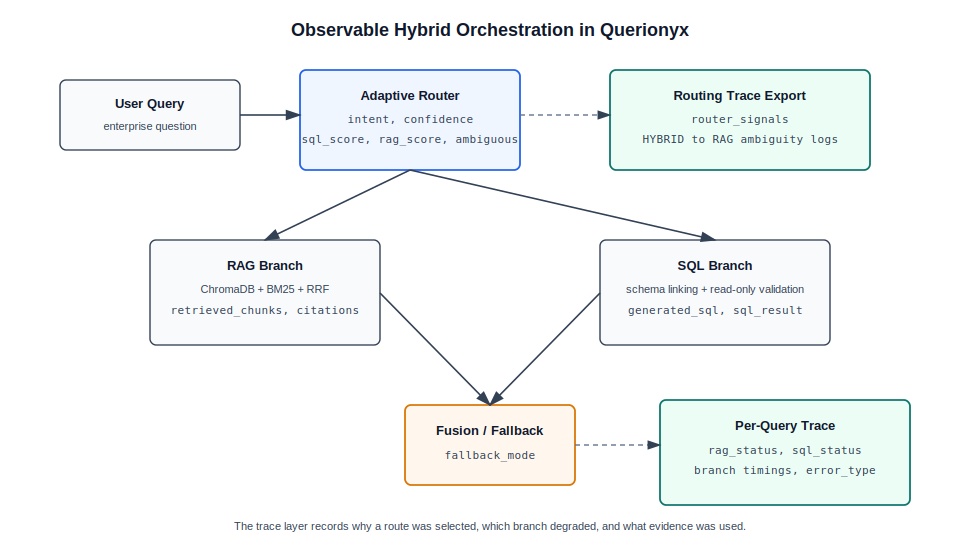

# Querionyx Paper Revision Pack

Prepared for the next revision before ICCCNet submission. This file contains replacement text and new paper sections based on the teacher feedback and the latest code changes:

- router confidence, routing signals, and ambiguity logging;
- hybrid branch status, fallback mode, branch timing, and evidence trace;
- per-query trace export and error taxonomy;
- explicit SQL safety validation;
- reproducibility configuration for RAG and SQL;
- baseline and async benchmark scripts.

Suggested framing shift:

> Querionyx is not just a combination of RAG and Text-to-SQL. The stronger contribution is practical enterprise hybrid orchestration under constrained environments: deterministic routing, observable branch execution, graceful fallback, reproducible evaluation, and traceable evidence fusion.

---

## Revised Title

Building Querionyx: Observable Hybrid Orchestration for Enterprise Question Answering with RAG, Text-to-SQL, and Adaptive Routing

Alternative shorter title:

Querionyx: Observable Hybrid Orchestration for Enterprise RAG and Text-to-SQL Question Answering

---

## Rewritten Abstract

Enterprise users rarely separate their questions according to data source. During development, we observed that many realistic questions moved between annual reports, policies, and relational tables within the same task: a user might ask for a sales figure and then ask how that figure relates to a strategy described in a report. Pure RAG handled the narrative evidence but failed on exact aggregation. Text-to-SQL handled counts and rankings but could not explain document-only context.

We built Querionyx to study this mixed setting as an orchestration problem rather than as a single-model QA task. The system routes each query to RAG, SQL, or HYBRID execution, runs document and database branches asynchronously when both are needed, and records confidence scores, routing ambiguity, branch status, fallback mode, generated SQL, retrieved chunks, and per-query traces for reproducibility. In the final runtime path, deterministic adaptive routing was more reliable than LLM routing, reaching 84.44% intent accuracy compared with 33.33% for the LLM router. On a balanced 90-query benchmark, Querionyx reached 96.67% end-to-end query success on the 90-query benchmark, while disabling hybrid execution caused the largest correctness drop. These results suggest that observable hybrid orchestration, not simply adding RAG to SQL, is the key design issue for enterprise QA.

Keywords: Retrieval-Augmented Generation, Text-to-SQL, Enterprise Question Answering, Hybrid Retrieval, Query Routing, Observable Orchestration

---

## Rewritten Introduction

Modern companies do not keep knowledge in one clean place. In our experiments, strategy, risk, and policy information usually appeared in PDF annual reports, while orders, customers, products, and revenue-related facts lived in relational tables. Users did not care about this boundary. They asked questions such as whether a business strategy aligned with a sales pattern, or which product category performed best and what the report said about market expansion. These questions are natural for analysts, but awkward for systems that assume one source at a time.

Retrieval-augmented generation is useful when the answer depends on long-form evidence. It helped Querionyx retrieve passages about business strategy, sustainability, risk, and operational plans from annual reports. Still, we repeatedly found that retrieval alone was weak for exact operations. It could retrieve a paragraph mentioning revenue, but it could not reliably count orders, rank customers, or compute total sales from order details. Related chunks were sometimes helpful but insufficient.

Text-to-SQL gave us the opposite behavior. It worked well for structured questions involving counts, averages, rankings, and filters, especially when the user wording matched the Northwind schema. But it could not explain a policy statement, interpret a risk narrative, or connect a database result to document evidence. We also encountered familiar Text-to-SQL issues: schema ambiguity, occasional syntax errors, and the need to validate generated SQL before execution.

These observations shaped Querionyx. Instead of forcing every question through one pipeline, we designed the system around routing, branch execution, fallback, and trace export. The router classifies queries into RAG, SQL, or HYBRID intents and now records confidence, SQL/RAG signal scores, matched keywords, and ambiguity flags. The hybrid handler runs RAG and SQL branches asynchronously, records branch status and timing, and saves intermediate evidence such as retrieved chunks, generated SQL, and SQL results. This made the system easier to evaluate and easier to explain when it failed.

We make five contributions:

- A modular enterprise QA architecture that connects RAG over PDF annual reports with Text-to-SQL over a PostgreSQL Northwind database.
- An adaptive router that reports intent, confidence, SQL/RAG signal scores, matched keywords, and ambiguity rather than only returning a label.
- An observable hybrid handler that supports asynchronous RAG and SQL execution, branch-level timing, fallback modes, and intermediate evidence export.
- A three-layer evaluation framework that separates routing quality, answer quality, and system performance, with per-query trace export for qualitative analysis.
- A reproducible benchmark and reporting pipeline with implementation configuration, error taxonomy, paper-ready tables, and baseline/async benchmark scripts.

The main research question is therefore not whether RAG and SQL can be placed in the same application. They can. The more useful question is how a constrained enterprise QA system should decide when to use each source, how it should behave when one branch fails, and how it should expose enough evidence for reviewers and users to trust the answer.

---

## Related Work Replacement

### 2.1 Retrieval-Augmented Generation and Hybrid Search

RAG reduces the burden on language models by retrieving external evidence before generation [1], [2]. This is important in enterprise settings because reports, policies, and risk disclosures change over time and cannot be treated as static model memory. However, the same design becomes fragile when a question requires exact computation. A retrieved passage may mention a metric, but it cannot replace aggregation, filtering, or joins over a database.

Hybrid search partially improves document retrieval by combining semantic and lexical matching. Dense retrieval is useful for paraphrased concepts, while BM25 preserves exact names, company terms, and metric expressions [5]. We adopted this combination because our queries often mixed broad business language with exact entities. In Querionyx, dense retrieval uses ChromaDB, sparse retrieval uses BM25, and reciprocal rank fusion combines the two ranked lists.

Even with stronger retrieval, RAG remains bounded by the evidence available in chunks. During evaluation, later RAG variants improved context precision more than recall. We interpret this as a practical saturation effect: once most relevant evidence is already retrievable, the next gain is reducing irrelevant context rather than discovering completely new evidence.

### 2.2 Text-to-SQL

Text-to-SQL systems translate natural language into executable SQL over relational schemas [3]. They are well suited for questions involving counts, averages, rankings, and filters. The difficult part is not only generation, but also schema linking: user language rarely maps perfectly to table and column names. In our SQL evaluation, the remaining failures included one schema error and one syntax error, which is consistent with this failure pattern.

Querionyx uses schema linking, constrained prompting, read-only SQL validation, execution feedback, and retry. The latest implementation makes the safety rule explicit by blocking non-read-only operations such as `INSERT`, `UPDATE`, `DELETE`, `DROP`, `ALTER`, and `TRUNCATE`. This matters because enterprise QA systems should not treat generated SQL as harmless text.

### 2.3 Query Routing and Modular RAG

Modular RAG argues that retrieval systems should be built from smaller components that can be reconfigured for different tasks [4]. Routing is one of the central pieces in such systems. In practice, however, a router that only returns a label is difficult to analyze. When a HYBRID query is routed to RAG, reviewers need to know whether the system missed a SQL signal or whether the query was genuinely ambiguous.

We therefore changed the Querionyx router to export more than intent. It records confidence, `sql_score`, `rag_score`, score margin, matched SQL keywords, matched RAG keywords, and an ambiguity flag. This makes routing failures usable for qualitative analysis instead of leaving them as opaque classification errors.

### 2.4 Self-RAG and Evaluation

Self-RAG improves retrieval-augmented generation by teaching the model to retrieve, generate, and critique its own outputs [12]. This line of work is valuable for document-grounded QA, but it does not directly solve structured database reasoning. Similarly, RAGAS evaluates faithfulness, context precision, and context recall [7], but its metrics are primarily designed around document retrieval and generation.

Querionyx extends evaluation in a different direction. It separates routing accuracy, RAG retrieval quality, SQL execution accuracy, hybrid correctness, branch fallback, and system latency. This separation helped us avoid hiding SQL errors inside end-to-end success or treating fallback as a simple failure.

### 2.5 System Comparison

Table 1 positions Querionyx against closely related system families. The key difference is not the existence of a RAG component or a SQL component in isolation, but the combination of adaptive routing, async hybrid execution, fallback behavior, and three-layer evaluation.

| System | RAG Support | SQL Support | Hybrid Execution | Adaptive Routing | Async Execution | Evaluation Depth |
|---|---:|---:|---:|---:|---:|---|
| Standard RAG | Yes | No | No | No | No | Retrieval and generation metrics |
| Text-to-SQL only | No | Yes | No | No | No | SQL execution and exact match |
| Self-RAG | Yes | No | Partial | Partial | No | RAG-centered critique and retrieval quality |
| Modular RAG [4] | Yes | Limited | Partial | Yes | Not central | Component-level RAG evaluation |
| Querionyx | Yes | Yes | Yes | Yes | Yes | Three-layer routing, answer, and system evaluation |

### 2.6 Research Gap Analysis

Standard RAG cannot reliably answer enterprise questions that require relational operations such as aggregation, joins, ranking, or filtered counts. Text-to-SQL systems solve structured querying but ignore qualitative evidence stored in reports, policies, and risk narratives. Self-RAG and modular RAG improve retrieval control, yet they do not fully evaluate what happens when document retrieval and SQL execution must run together under latency and failure constraints. Existing work also tends to report final accuracy without exposing branch-level degradation, fallback decisions, or per-query evidence traces. Querionyx was built to examine this unresolved operational layer of enterprise hybrid QA.

---

## New Implementation Details Section

Add this after Section 3.5, or fold it into Section 3 as Section 3.6.

### 3.6 Instrumentation and Reproducibility Details

After the first evaluation pass, we found that several failures were difficult to explain from final answers alone. A wrong answer could come from misrouting, weak retrieval, invalid SQL, empty SQL results, or a failed fusion step. We therefore added instrumentation directly into the runtime pipeline.

The router now exports a trace object:

```json
{
  "intent": "HYBRID",
  "confidence": 0.83,
  "signals": {
    "sql_score": 0.775,
    "rag_score": 0.700,
    "score_margin": 0.075
  },
  "ambiguous": true,
  "matched_sql_keywords": ["count", "total"],
  "matched_rag_keywords": ["explain", "strategy"]
}
```

The hybrid handler exports branch-level observability:

```json
{
  "rag_status": "success",
  "sql_status": "schema_error",
  "fallback_mode": "RAG_ONLY",
  "rag_latency_ms": 220,
  "sql_latency_ms": 180,
  "fusion_latency_ms": 40,
  "retrieved_chunks": ["..."],
  "generated_sql": "SELECT ...",
  "sql_result": []
}
```

The RAG runtime uses chunks of 800 characters with 120-character overlap. Dense retrieval uses `sentence-transformers/paraphrase-multilingual-MiniLM-L12-v2`, a multilingual 384-dimensional embedding model. Sparse retrieval uses BM25 with `k1 = 1.5` and `b = 0.75`. The dense top-k and sparse top-k are both 5, and the final fused context keeps the top 3 chunks after reciprocal rank fusion with `k = 60`.

The SQL module validates generated queries before execution. Only `SELECT` and `WITH` statements are allowed, and unsafe keywords such as `DROP`, `DELETE`, `UPDATE`, `INSERT`, `ALTER`, and `TRUNCATE` are explicitly blocked. PostgreSQL execution also runs in a read-only session. This validation is important because Text-to-SQL output is executable code, not only generated text.

Figure 5 summarizes the observable orchestration layer added to the implementation.



**Figure 5.** Observable hybrid orchestration in Querionyx. The updated runtime records routing signals, branch status, fallback mode, evidence, generated SQL, and per-query error types.

---

## Evaluation Additions

### 4.6 Qualitative Case Analysis

Quantitative scores helped us locate broad patterns, but the most useful debugging information came from individual traces. Table 6 shows representative cases from the evaluation, including a correct hybrid answer, a HYBRID-to-RAG misrouting case, a SQL schema failure, and fallback behavior when one branch degraded.

| Query | True Intent | Predicted Intent | Key Evidence Used | Final Answer Quality | Error Type |
|---|---|---|---|---|---|
| Which product category generated the highest sales, and how does this relate to the company growth strategy? | HYBRID | HYBRID | SQL aggregation over order details and product categories; annual-report chunks about growth strategy | Correct. The answer combines a structured sales result with document context instead of treating the two sources separately. | None |
| What does the company say about revenue growth in relation to customer demand? | HYBRID | RAG | Retrieved report chunks discussing revenue growth and demand | Partially correct. The answer explains the narrative evidence but omits the supporting database figure because the query sounded document-heavy. | Misrouting: HYBRID to RAG |
| List total revenue by customer segment. | SQL | SQL | Generated SQL over customer and order tables | Incorrect execution. The generated query assumed a customer segment field that is not present in the Northwind schema. | Schema ambiguity |
| Compare the best-selling product with the report discussion of market expansion. | HYBRID | HYBRID | SQL branch identified top-selling products; RAG branch retrieved related but insufficient market-expansion chunks | Acceptable but incomplete. The SQL result was preserved, while the weak document branch triggered conservative fallback. | RAG fallback |
| How many orders were shipped late, and what operational risks are mentioned in the report? | HYBRID | HYBRID | Operational-risk passages from annual reports; SQL branch attempted a shipment-delay query | Partially correct. The system returned the document-side risk explanation but could not provide a reliable late-shipment count. | SQL fallback |

These cases show why per-query traces were necessary. The main routing weakness was not random intent confusion, but HYBRID queries that looked like narrative RAG questions while still requiring structured evidence. SQL failures were rare, with one schema error and one syntax error across 30 SQL queries, whereas hybrid fallback was more common: 6 RAG fallback cases and 11 SQL fallback cases indicate that graceful degradation is part of the system behavior rather than an exception.

### 4.7 Baseline Comparison Protocol

The main benchmark compares internal modules, but reviewers may still ask what Querionyx improves over simpler systems. We therefore add a small baseline evaluation over 10-20 representative queries. The goal is not to claim large-scale superiority, but to show what fails when routing, SQL, or retrieval are removed.

Baselines:

- **GPT-only:** answer directly with the local LLM, without retrieval or database access.
- **Plain RAG:** use document retrieval only, without SQL or hybrid execution.
- **Querionyx:** full router, RAG, SQL, and hybrid orchestration.

Suggested reporting table after running:

```powershell
python -m src.evaluation.eval_baselines --selection mixed --rag-count 5 --sql-count 5 --hybrid-count 10
```

| System | Query Count | Correctness | Groundedness | Hallucination Risk | Avg Latency |
|---|---:|---:|---:|---:|---:|
| GPT-only | 20 | To be filled from `metrics/baseline_eval` | To be filled | To be filled | To be filled |
| Plain RAG | 20 | To be filled from `metrics/baseline_eval` | To be filled | To be filled | To be filled |
| Querionyx | 20 | To be filled from `metrics/baseline_eval` | To be filled | To be filled | To be filled |

Expected interpretation:

GPT-only is useful as a weak baseline because it exposes hallucination risk when no enterprise evidence is available. Plain RAG is stronger for document questions but weak on SQL and HYBRID questions requiring aggregation. Querionyx should be strongest on mixed-source cases because it can preserve database evidence and document context in the same answer. The subset must be mixed by intent; using the first 20 rows of the 90-query benchmark is methodologically unsafe because the dataset is grouped and would over-sample document-only questions.

### 4.8 Async Execution Benchmark

The hybrid handler claims asynchronous branch execution, so the evaluation should verify this behavior. The updated code includes `src/evaluation/benchmark_async_hybrid.py`, which compares sequential execution with async execution using the same HYBRID query subset.

Suggested reporting table after running `python -m src.evaluation.benchmark_async_hybrid --limit 10`:

| Mode | Query Count | P50 Latency | P95 Latency | Average Latency |
|---|---:|---:|---:|---:|
| Sequential | 10 | To be filled from `metrics/async_hybrid` | To be filled | To be filled |
| Async | 10 | To be filled from `metrics/async_hybrid` | To be filled | To be filled |

This table is important because it turns "async execution" from an architectural claim into a measurable runtime property. If the speedup is modest, the interpretation should be honest: async execution reduces waiting time when both branches are active, but total latency still depends on retrieval, SQL execution, and fusion overhead.

---

## Revised Conclusion

Querionyx taught us that enterprise QA is less about choosing between documents and databases than about coordinating both under imperfect conditions. The strongest signal from the evaluation is that hybrid execution carries most of the system value: when it was removed, correctness dropped more than with any other ablation. We also found that the deterministic router was more dependable than the LLM router in this setting, which matters for resource-constrained deployment where stability and traceability are often more useful than adding another model call.

There are still clear limits. The 90-query benchmark is balanced and reproducible, but it does not capture the full diversity of live enterprise language. The document corpus is limited to selected annual reports, and Northwind is useful for controlled testing but simpler than a real enterprise warehouse. Some hybrid queries still degrade into fallback mode, which keeps the answer usable but may leave either the document or SQL side under-supported.

The next steps are practical. We plan to expand the benchmark with noisier and more ambiguous hybrid questions, including Vietnamese enterprise reports, because these are where routing and retrieval failures become most visible. We also need explicit hybrid decomposition so the system can separate the SQL part of a question from the document-reasoning part before branch execution. Finally, provenance scoring should be added on top of the existing trace export so users can judge not only what answer was returned, but how strongly each evidence branch supports it.

---

## Short Novelty Paragraph for Discussion

The novelty of Querionyx is not the isolated use of RAG or Text-to-SQL. Both are established components. The more specific contribution is the orchestration layer around them: deterministic intent routing with confidence and ambiguity traces, asynchronous branch execution, fallback-aware hybrid answering, and a three-layer evaluation pipeline that exposes where each error occurs. This design makes Querionyx closer to an observable enterprise QA framework than to a single QA model.

---

## Paper Editing Checklist Before Submission

- Replace the old Abstract, Introduction, Related Work, and Conclusion with the rewritten versions above.
- Add Table 1 from the Related Work replacement as the novelty comparison table.
- Add Figure 5 and the instrumentation subsection after the hybrid handler section.
- Add Section 4.6 qualitative case analysis.
- Run the baseline and async scripts if time allows, then fill Sections 4.7 and 4.8 with actual values.
- Keep the old main metrics unless the full benchmark is rerun after instrumentation changes.
- Avoid the phrases flagged by the teacher in the final manuscript.

---

## Commands for New Evidence

```powershell
python -m src.evaluation.export_reproducibility_config
python -m src.evaluation.enrich_benchmark_metadata --dataset benchmarks\datasets\eval_90_queries.json --output metrics\benchmark_metadata\eval_90_queries_enriched.json
python -m src.evaluation.eval_baselines --dataset benchmarks\datasets\eval_90_queries.json --selection mixed --rag-count 5 --sql-count 5 --hybrid-count 10
python -m src.evaluation.benchmark_async_hybrid --dataset benchmarks\datasets\eval_90_queries.json --limit 10
python -m src.evaluation.benchmark_runner --dataset benchmarks\datasets\eval_90_queries.json --config ablation\configs\full_v3.json
```
